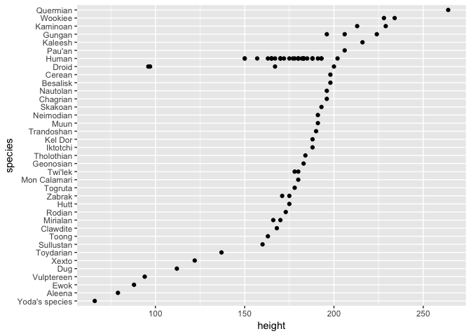

Test of rendering an R script
================
By Steven
07 November, 2018

Here I'm testing out how to put special \#' comments into an ordinary old R script, so that RStudio can turn it into nicely formatted markdown for me. This bit should come out as text. Whereas with a normal \# comment, what comes looks like part of the code.

``` r
# Load packages
library(tidyverse)
```

    ## ── Attaching packages ─────────────────────────────────────────────── tidyverse 1.2.1 ──

    ## ✔ ggplot2 3.1.0     ✔ purrr   0.2.5
    ## ✔ tibble  1.4.2     ✔ dplyr   0.7.7
    ## ✔ tidyr   0.8.2     ✔ stringr 1.3.1
    ## ✔ readr   1.1.1     ✔ forcats 0.3.0

    ## ── Conflicts ────────────────────────────────────────────────── tidyverse_conflicts() ──
    ## ✖ dplyr::filter() masks stats::filter()
    ## ✖ dplyr::lag()    masks stats::lag()

Hmmm... I wonder if there is a way to hide the **result** of running *some chunk of code* from appearing in the markdown file? R attaching packages is not very interesting. (Note adding some **bold** and *italics* there.)

Now I'll write some code to plot the heights of Star Wars characters, arranged by species. The markdown file should contain both the code and the plot that it generates.

``` r
starwars %>%
  filter(!is.na(height), !is.na(species)) %>%
  group_by(species) %>%
  mutate(max.height = max(height)) %>%
  ungroup() %>%
  arrange(max.height, species) %>%
  mutate(species = factor(species, unique(species))) %>%
  ggplot(aes(height, species)) +
  geom_point()
```



Amazing! I'll push this to GitHub to see how it looks there.
